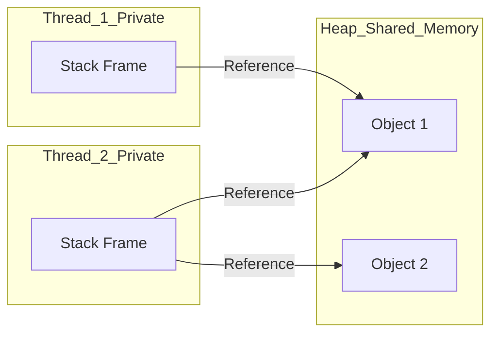

### 1. The "Why"
In a multithreaded application, we need to know where data lives to understand its visibility. If data is on the **Stack**, it is private and safe. If data is on the **Heap**, it is shared and potentially dangerous. This distinction determines whether we need synchronization (locks/mutexes) or if the code is "thread-safe" by design.

### 2. Visual Logic
Every thread gets its own private **Stack**, but all threads share a single, massive **Heap**.


* **The Stack:** Stores local variables and method call frames. It is "Last-In, First-Out" (LIFO).
* **The Heap:** Stores all Objects (e.g., `String`, `Integer`, `UserCustomClass`). Even if an object is created inside a method, the *reference* is on the stack, but the *actual object* stays on the heap.



### 3. The "Golden" Snippet
This code highlights how a shared object on the heap can be accessed by two different stacks simultaneously.

```java
public class MemorySharing {
    public static void main(String[] args) {
        // SharedObject lives on the HEAP
        SharedResource resource = new SharedResource(); 

        // Both threads get a REFERENCE on their private STACK 
        // pointing to the same object on the HEAP
        Thread t1 = new Thread(() -> resource.increment());
        Thread t2 = new Thread(() -> resource.increment());

        t1.start();
        t2.start();
    }

    static class SharedResource {
        private int counter = 0; // Lives on the HEAP
        
        public void increment() {
            int localDelta = 1; // Lives on the private STACK (Thread-Safe)
            this.counter += localDelta; // Shared access (Not Thread-Safe!)
        }
    }
}
```

### 4. The Gotchas
* **The Reference Trap:** A common mistake is thinking that because a variable is "local" to a method, it is safe. If that local variable is a **reference** to an object (e.g., `List<String> list = ...`), the list itself is on the heap. If you pass that reference to another thread, you've just shared it!
* **Primitive vs. Object:** Primitives (`int`, `long`, `boolean`) stored in methods are strictly on the stack. Their "Boxed" counterparts (`Integer`, `Long`) are objects and live on the heap.
* **StackOverflowError:** Since stacks are small and private, deep recursion or infinite loops will crash a specific thread.
* **OutOfMemoryError:** Since the heap is shared, if one thread creates too many objects, it can crash the entire application for all threads.