# Introduction to Performance & Optimization for Latency

### 1. The "Why"
In a single-threaded environment, tasks are executed sequentially, meaning the total time is the sum of all tasks. We use multithreading for **Latency Optimization** to break a single intensive task into smaller sub-tasks that run in parallel, reducing the wall-clock time the user has to wait for a result.

### 2. Visual Logic
The goal is to move from a "Serial" execution to a "Parallel" execution. If a task can be decomposed, we distribute the workload across multiple CPU cores.

```mermaid
gantt
    title Latency: Serial vs Parallel
    dateFormat  ss
    axisFormat  %S
    section Serial
    Task A (Thread 1) :a1, 00, 10s
    Task B (Thread 1) :after a1, 10s
    section Parallel
    Task A (Thread 1) :b1, 00, 10s
    Task B (Thread 2) :b2, 00, 10s
```




### 3. The "Golden" Snippet
This example demonstrates a simple **Image Processing** pattern where we split a workload (like an array of pixels) between two threads to reduce latency.

```java
public class LatencyOptimizer {
    public void parallelProcess(byte[] data) {
        int midpoint = data.length / 2;
        
        Thread t1 = new ProcessingThread(data, 0, midpoint);
        Thread t2 = new ProcessingThread(data, midpoint, data.length);
        
        t1.start();
        t2.start();
        
        try {
            t1.join(); // Wait for sub-task to finish
            t2.join();
        } catch (InterruptedException e) { /* Handle error */ }
    }
}
```

### 4. The Gotchas
* **The Overhead Trap:** Creating a thread isn't free. If the task is too small (e.g., adding two integers), the time spent creating and destroying the thread will exceed the time saved by parallelization.
* **Amdahl's Law:** Your speedup is limited by the "sequential" part of your code. If 50% of your task *must* be serial, you can never speed up the total task by more than 2x, no matter how many threads you add.
* **Hyper-threading vs. Physical Cores:** Don't assume 16 "logical" cores behave like 16 "physical" cores; resource contention at the hardware level can diminish latency gains.

---